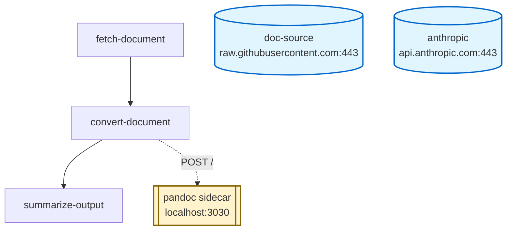

```mermaid
graph TD
    fetch-document[fetch-document]
    convert-document[convert-document]
    summarize-output[summarize-output]
    fetch-document --> convert-document
    convert-document --> summarize-output

    %% External Dependencies
    dep_doc_source[(doc-source<br/>raw.githubusercontent.com:443)]
    style dep_doc_source fill:#e1f5ff,stroke:#0066cc,stroke-width:2px
    dep_anthropic[(anthropic<br/>api.anthropic.com:443)]
    style dep_anthropic fill:#e1f5ff,stroke:#0066cc,stroke-width:2px

    %% Sidecar
    sidecar_pandoc[[pandoc sidecar<br/>localhost:3030]]
    style sidecar_pandoc fill:#fff3cd,stroke:#856404,stroke-width:2px
    convert-document -.->|POST /| sidecar_pandoc
```
