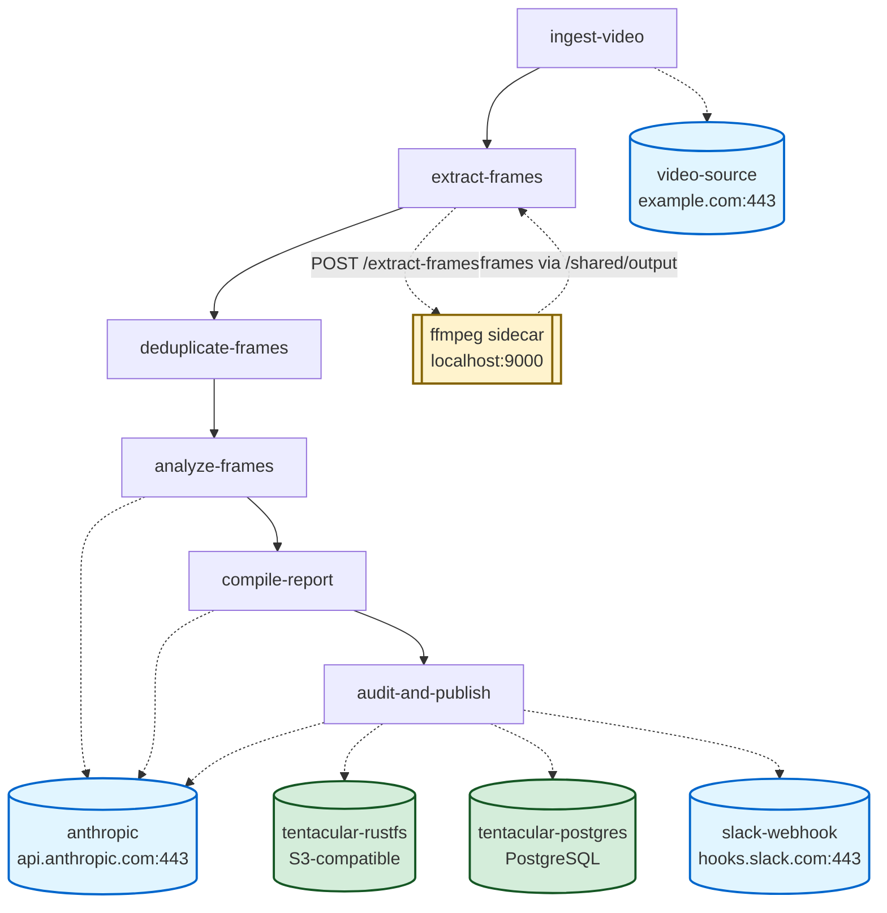

```mermaid
graph TD
    ingest-video[ingest-video]
    extract-frames[extract-frames]
    deduplicate-frames[deduplicate-frames]
    analyze-frames[analyze-frames]
    compile-report[compile-report]
    audit-and-publish[audit-and-publish]

    ingest-video --> extract-frames
    extract-frames --> deduplicate-frames
    deduplicate-frames --> analyze-frames
    analyze-frames --> compile-report
    compile-report --> audit-and-publish

    %% Sidecar
    sidecar_ffmpeg[[ffmpeg sidecar<br/>localhost:9000]]
    style sidecar_ffmpeg fill:#fff3cd,stroke:#856404,stroke-width:2px
    extract-frames -.->|POST /extract-frames| sidecar_ffmpeg
    sidecar_ffmpeg -.->|frames via /shared/output| extract-frames

    %% External Dependencies
    dep_video_source[(video-source<br/>example.com:443)]
    dep_anthropic[(anthropic<br/>api.anthropic.com:443)]
    dep_rustfs[(tentacular-rustfs<br/>S3-compatible)]
    dep_postgres[(tentacular-postgres<br/>PostgreSQL)]
    dep_slack[(slack-webhook<br/>hooks.slack.com:443)]

    style dep_video_source fill:#e1f5ff,stroke:#0066cc,stroke-width:2px
    style dep_anthropic fill:#e1f5ff,stroke:#0066cc,stroke-width:2px
    style dep_rustfs fill:#d4edda,stroke:#155724,stroke-width:2px
    style dep_postgres fill:#d4edda,stroke:#155724,stroke-width:2px
    style dep_slack fill:#e1f5ff,stroke:#0066cc,stroke-width:2px

    ingest-video -.-> dep_video_source
    analyze-frames -.-> dep_anthropic
    compile-report -.-> dep_anthropic
    audit-and-publish -.-> dep_anthropic
    audit-and-publish -.-> dep_rustfs
    audit-and-publish -.-> dep_postgres
    audit-and-publish -.-> dep_slack
```
