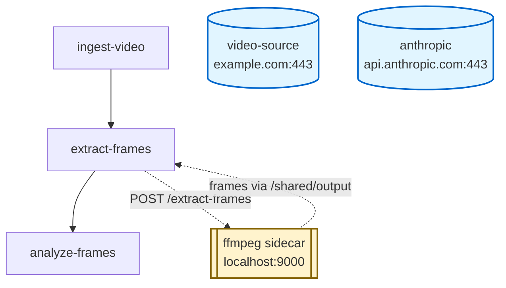

```mermaid
graph TD
    ingest-video[ingest-video]
    extract-frames[extract-frames]
    analyze-frames[analyze-frames]
    ingest-video --> extract-frames
    extract-frames --> analyze-frames

    %% External Dependencies
    dep_video_source[(video-source<br/>example.com:443)]
    style dep_video_source fill:#e1f5ff,stroke:#0066cc,stroke-width:2px
    dep_anthropic[(anthropic<br/>api.anthropic.com:443)]
    style dep_anthropic fill:#e1f5ff,stroke:#0066cc,stroke-width:2px

    %% Sidecar
    sidecar_ffmpeg[[ffmpeg sidecar<br/>localhost:9000]]
    style sidecar_ffmpeg fill:#fff3cd,stroke:#856404,stroke-width:2px
    extract-frames -.->|POST /extract-frames| sidecar_ffmpeg
    sidecar_ffmpeg -.->|frames via /shared/output| extract-frames
```
